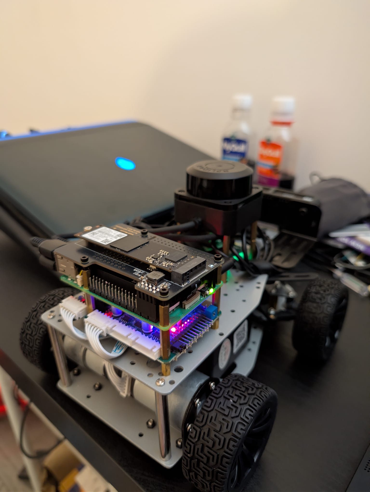
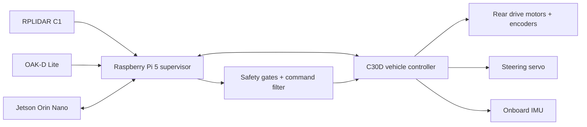
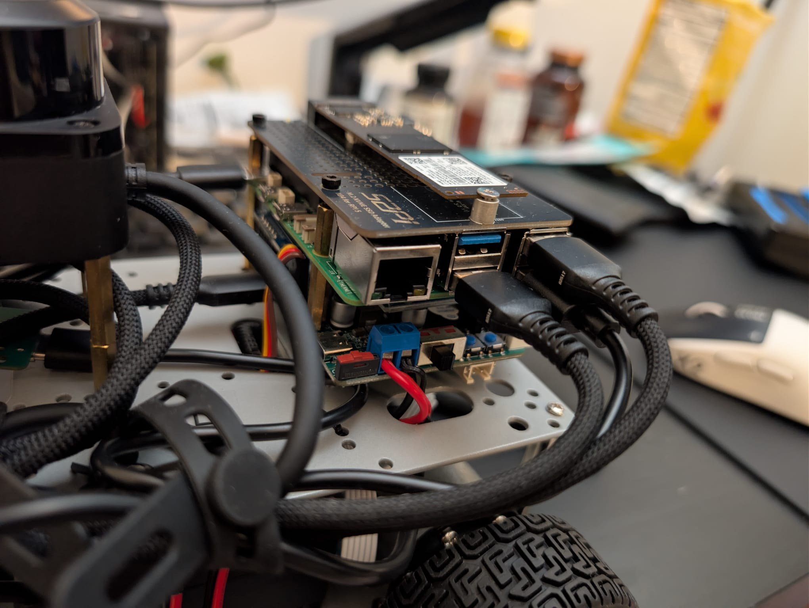
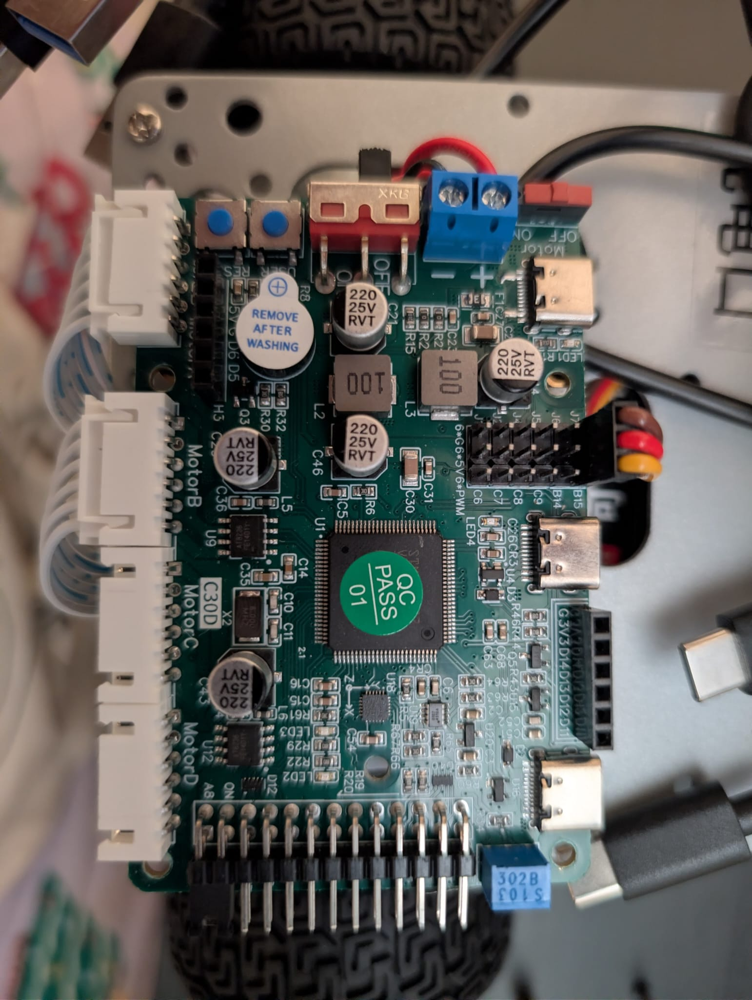

# Native Ackermann Autonomous Robot

A safety-first, non-ROS autonomy stack for a custom Ackermann-steering research robot. The platform combines a Raspberry Pi 5 supervisor, a Jetson Orin Nano compute module, an OAK-D Lite depth camera, an RPLIDAR C1, and a C30D vehicle controller in a modular Python architecture.



## Project at a glance

| Area | Implementation |
|---|---|
| Vehicle | Four-wheel Ackermann-steering chassis |
| Low-level supervisor | Raspberry Pi 5 running native Python |
| Edge compute | Jetson Orin Nano for vision, mapping, and learned navigation workloads |
| Vehicle interface | C30D controller for drive motors, steering servo, encoder feedback, and onboard IMU |
| Perception | OAK-D Lite RGB-D camera and RPLIDAR C1 2D lidar |
| State estimation | Provisional C30D dead reckoning with offline replay and visualization |
| Mapping | Recorded-scan processing and ray-traced occupancy-grid generation |
| Safety | Dry-run defaults, command limiting, stale-data handling, arming gates, and bounded hardware tests |
| Runtime | Native Python; no ROS or ROS 2 dependency |

## System architecture



The Raspberry Pi owns the time-critical safety boundary and hardware interfaces. The Jetson is reserved for heavier perception and navigation workloads, while all outgoing motion commands remain subject to Pi-side limits and freshness checks.



## Engineering highlights

### Safety-first control

The supervisor composes robot state, a safety manager, command filtering, and the C30D driver behind explicit interfaces. Safe behavior is the default: the main supervisor currently uses a mock driver, serial writes are disabled in configuration, and experimental motion utilities require deliberate arming and physical-test confirmations.

Implemented safeguards include:

- bounded speed, reverse-speed, steering-angle, acceleration, and test-duration limits;
- dry-run operation and neutral-command defaults;
- manual-enable and wheels-lifted gates for hardware experiments;
- stale command and sensor handling;
- battery and serial-feedback readiness checks; and
- constrained zero-frame and low-speed diagnostic utilities.

### C30D protocol investigation

The repository documents a reverse-engineering workflow for the integrated C30D controller. Passive serial captures established a fixed 24-byte feedback frame with `0x7B`/`0x7D` delimiters and an XOR checksum over bytes 0–21. Candidate motion, yaw, IMU, and battery fields can be decoded, compared across captures, exported, and plotted without transmitting to the robot.

An 11-byte host-command candidate based on WHEELTEC reference material is also represented in code. It remains treated as hardware-dependent and experimental; observed command behavior and board operating mode still require validation before the interface can be considered complete.



### Sensor capture and mapping foundations

The tooling supports bounded read-only capture from the C30D, RPLIDAR, and OAK-D Lite into timestamped run folders. Saved runs can be validated and replayed offline. The mapping layer includes:

- lidar CSV loading and scan segmentation;
- single-scan Cartesian visualization;
- ray-traced occupancy-grid generation;
- provisional straight-line odometry replay; and
- synchronized sensor-run summaries.

These components form the data and interface layer for future scan matching, sensor fusion, SLAM, and learned navigation work.

## Current project status

| Capability | Status |
|---|---|
| Native supervisor, state model, configuration, and logging | Implemented |
| Safety evaluation and command filtering | Implemented and unit tested |
| C30D passive feedback capture and checksum validation | Implemented |
| Candidate feedback-field analysis and plotting | Implemented |
| RPLIDAR and OAK-D bounded capture tools | Implemented |
| Recorded-run validation, replay, and occupancy grids | Implemented |
| Provisional straight-line dead reckoning | Implemented; calibration still required |
| Reliable closed-loop drive and steering through the C30D | In validation |
| Multi-sensor SLAM and autonomous navigation | Planned |

The repository preserves ongoing research artifacts as project evidence. It should not be interpreted as a ready-to-install vehicle-control package or as proof that unrestricted autonomous motion has been validated on hardware.

## Repository structure

```text
src/ackermann_robot/
  control/       Arming, safety evaluation, and command filtering
  drivers/       C30D framing, feedback parsing, and command research
  odometry/      Provisional dead-reckoning components
  slam/          Recorded lidar types, loading, and occupancy grids
  utils/         Configuration and logging utilities
scripts/         Hardware diagnostics, capture, analysis, and replay tools
config/          Robot geometry, interfaces, limits, and safety settings
docs/            Safety plan, C30D research, and integrated architecture notes
c30d_control/    Experimental calibrated C30D control utilities
tests/           Mock-based and offline unit tests
media/           Project photography
```

## Design principles

- Keep safety-critical supervision on the Raspberry Pi.
- Isolate hardware access behind drivers and test it with mocks where possible.
- Keep calibration and connection details in configuration rather than source code.
- Make hardware experiments finite, explicit, and easy to stop.
- Label inferred protocol fields and incomplete capabilities honestly.
- Preserve a native Python path without requiring ROS 2.

## Next steps

- Complete repeatable steering and longitudinal-command validation on the C30D.
- Calibrate wheel motion and yaw feedback against measured chassis motion.
- Fuse encoder, IMU, and lidar observations for planar localization.
- Add scan matching and pose-aware occupancy mapping.
- Connect Jetson perception outputs through a bounded, freshness-checked command interface.
- Evaluate closed-loop waypoint following and obstacle-aware local planning.

## Safety note

This repository contains experimental robotics code capable of interacting with physical hardware. Motion testing requires a restrained vehicle, lifted wheels where appropriate, a ready manual power cutoff, conservative limits, and direct supervision. See [`docs/SAFETY.md`](docs/SAFETY.md) for the project-specific safety model.
